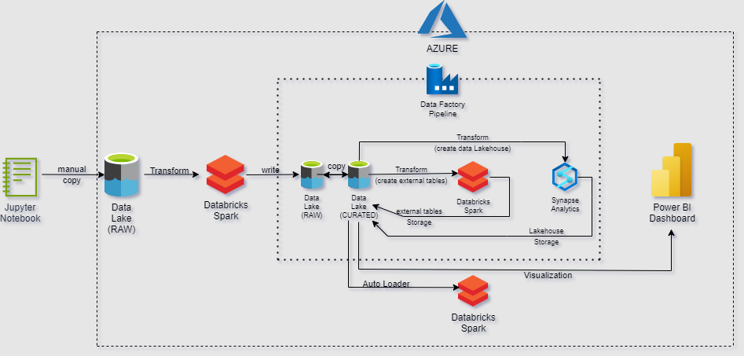
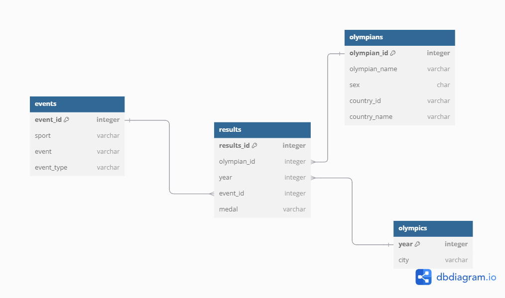
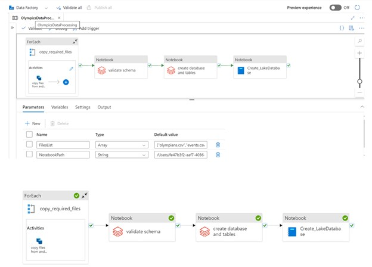

# Olympics-Historical-Data-Analysis
[Azure data engineering project to analyze the complete summer Olympics data (1932 - 2024)]

## Introduction

The **Olympics Data Engineering Project** focuses on enriching and processing a publicly available Olympic dataset to create an star schema data model. The project utilizes **Azure Databricks**, **Azure Data Lake Storage (ADLS)**, **Apache Spark**, **Azure Data Factory**, **Azure Synapse Analytics**, and **Power BI** to build a scalable, automated data pipeline, transform raw data into a star schema, and ultimately visualize Olympic performance data through Power BI.
The objective of this project is to analyze summer Olympic results over the years and to create a powerful reporting and analytical framework using modern cloud and big data technologies on Azure cloud.

## Complete Project Architecture

## Technologies used

1. Programming Language - Python (pyspark, pandas)
2. Scripting Language - SQL
3. Azure Cloud
   - Azure Data Lake Storage (ADLS)
   - Azure DataBricks
   - Azure Data Factory (ADF)
   - Azure Synapse Analytics
   - Power BI

## Dataset used

The project uses a dataset from **Kaggle** that contains summer Olympic results from 1896 to 2024. It contains columns: [player_id, player_name, sex, team, NOC (name of the country), sport, event, medal].

dataset : [olympics_dataset](olympics_dataset.csv.gz)

original_dataset : [Kaggle](https://www.kaggle.com/datasets/stefanydeoliveira/summer-olympics-medals-1896-2024?resource=download)

## Steps Involved

### 1. **Priliminary Data Exploration and Analysis**
   - Initially, the dataset was analyzed using **Jupyter notebooks** to explore its schema, data types, and structure.
   - Key insights from the dataset were identified, and the necessary data cleaning steps were planned for the next stages of the project.
   - In the early Olympic Games, particularly in the late 19th and early 20th centuries, there were multiple teams from each country because national sports federations were not yet well-established, also International Oympics Fe and athletes often competed as individuals or regional representatives rather than as part of a unified national team.
   - As the Olympics grew in importance and scope, the International Olympic Committee (IOC) and national governing bodies during the early 1930s, began to standardize the representation of countries, leading to the formation of a single, unified national team per country for each Olympic event.
   - After this preliminary analysis, it was decided to consider Olympics data from 1932 to 2024 for the purpose of this project.

  Here are the html files of the priliminary analysis which was done via Jupyter Notebook:
  [jupyter_notebooks](jupyter_notebooks/olympics_data_prelim_analysis.html)

### 2. **Data Enrichment using Azure Databricks**

   - The Raw dataset csv file was manually uploaded to the **RAW** layer of **raw ADLS**.
   - Using **Azure Databricks**, the raw data was enriched and transformed into a **star schema**:
     - **Olympics Table**: Contains details such as Olympic year and host city.
     - **Events Table**: Contains details about the event ID, sport, and its specific events.
     - **Olympians Table**: Contains information about Olympians such as olympian ID, name, sex, and country.
     - **Results Table (fact table)**: Contains the results data, including result ID, olympian ID, Olympic year, and event ID.
   - These finalized tables data were written to **CONFORMED** layer of the **raw ADLS** as csv files

  Here are the html files of the databricks notebooks whcih was used for enriching the data : [enrich_data](databricks_notebooks/Enrich_the_Data.html), [enrich_data(contn)](databricks_notebooks/Enrich_the_Data(continued).html)
  
  Refer the finalized table data : [finalized_tables_data](finalized_tables)

### **Data Model**

### 3. **Data Processing using Azure Data Factory**

Using **Azure Data Factory**, a pipeline was built to process the data and create **delta lake** and **data lakehouse**

   1. **Copy Data from Raw ADLS to Curated ADLS**  
     - A **ForEach Activity** in the pipeline ensured that only the necessary files were copied, and a **Copy Activity** handled the actual data transfer of finalized table data in parquet format from **conformed** layer of **raw ADLS** (csv files) to the **conformed** layer of **curated ADLS** (as parquet files). 

   2. **Schema Validation**
     - After the data was copied to the **conformed** layer of **curated ADLS**, the **schema** of the copied datasets was validated using a **Databricks notebook** to ensure the data conformed to the expected structure.

      Refer Notebook : [Validate_Schema](databricks_notebooks/Validate_Schema.html)

   4. **Delta Lake Creation**
     - A Databricks notebook was used to create a **Delta Lake** and to register the finalized data as **external tables** in the Hive catalog, making the data available for further analysis. The extenral tables are stored in the **curated** layer of **curated ADLS** in delta format.

      Refer Notebook : [create_database_and_tables](databricks_notebooks/Create_Database_and_Tables.html)
      
      Refer doc : [delta_lake](delta_lake.docx)

   6. **Data Lakehouse Creation in Synapse Analytics**
     - A Synapse spark notebook was used to create a **Data Lakehouse** in **Synapse Analystics** so that the data can be analysed using SQL.

      Refer Notebook : [create_datalakehouse](Create_LakeDatabase.html)

      Refer doc : [data_lakehouse](data_lakehouse_details.docx)

### **Data Factory Pipeline**

### 4. **Simulating Incremental Data Loads**
   - To simulate incremental data loads, the **Results Table** was split by the **Olympic year** column. This was achieved using a **Jupyter notebook**.
   - An **Auto-Loader** was created in **Databricks**, which allows for automatic updating of the **Results Table** whenever new Olympic year data is added.
   - When the individual files whcih were optained by spliting the original results table data are manually uploaded to the **conformed** layer of the **curated ADLS**, the auto-loader would pick the newly added files and incrementally load it to **results** directory in the **curated** layer of **curated ADLS**.

  Refer notebook used to split the results data : [results_split_for_incremental_load](jupyter_notebooks/results_enrich.html)

  Refer the split results data files : [results_files](results_data)
  
  Refer auto-loader : [auto-loader](databricks_notebooks/results_AutoLoader.html)

### 5. **Visualization and Reporting**

Using Power BI, a dashboard was created using the finalized olympics data.

dashboard: https://app.powerbi.com/view?r=eyJrIjoiNDZhOTE2YTktMWU5ZS00MjFkLTk3OGMtOTYyZjAzOWUyNDZmIiwidCI6ImE1ZmEwNDYyLTRhZWUtNGI3OC05MzEyLTFmMDBkMDlmNmRkOCJ9&pageName=36849c21ea3503d84c5a

dashboard pbix file: [original_dashboard_file](BI.pbix)

Refer SQL query used to get insists from the data in Synapse Data Lakehouse : [sql_query_on_data_lakehouse](Total_Medals_Tally.sql)

## Security

This project not only focuses on core data engineering activities but also prioritizes security where ever possible.
Securing the complete project atchitecture:

  - **Azure Service Principal** has been used for databricks to connect to the ADLS. **service-credential-key** is stored as a secret in **Azure key vault** and the databricks serive principal has been granted the requried prvileges to access this secret and also to read and write in ADLS. Using this a databricks cluster or notebook can securly connect to ADLS.
  - ADF connects to the ADLS, uses databricks' cluster and notebooks and also uses Synapse spark notebooks securely via the **System Assigned Managed Identity**

Refer doc : [security_implementation](security_implementation.docx)

## Challenges Faced

  ### 1. Data Enrichment (countries and its teams complexity):
  During the preliminary analysis, it was noted that there were many diffrerent teams for each country and also there were many countries which doesn't exists in the current world. As the standardizations and olympics committe was formed during early 1930s, it was considered to take only the data from 1932 to 2024.
  Even the data from 1932 to 2024 contained multiple national teams for a single country and also many countries which doesn't exists today. Only the team names which had the original country name were selected and also excluded the countries which doesn't exists today. Also alterations were made such that the entries with the old country name like USSR (currently Russia) have the new existing names and also countries which were divided but now are united are altered to have the same country name (ex: east and west Germany, now united as Germany). Few of the important old counties which does exists today were also included (Yugoslavia and Czechoslovakia)
  After all these changes the countries table had 214 counties.

  ### 2. Data Entrichment (Sport and its events complexity):
  To create the events dimention table, the original dataset had duplicate event names (ex: basketball sport in 2020 olympics has events basketball men's and basketball women's but the event names for the same sport in 2024 olympics is basketball men's team and basketball women's team) this duplicate names of events exists for many sports and there are around 900 events. Searching and removing all the duplicate events and also make that same changes in the results table would be a cumbersome job, hence the events table is left with duplicate events and it wouldn't impact the Olympics data analysis in anyway, as the anlysis would not drill-down to specific event.

  Here are the html files of the databricks notebooks whcih was used for enriching the data : [enrich_data](databricks_notebooks/Enrich_the_Data.html), [enrich_data(contn)](databricks_notebooks/Enrich_the_Data(continued).html)

  ### 3. Schema infer issue:
  In the olympics_data_processing ADF pipeline, the copy activity copied the finalized data as csv from Raw ADLS to Curated ADLS as parquet, but the copied files had wrong schema inference (ex: result_id, year, event_id were int but it was infered as string in copied files). To tackle this, a databricks notebook was created to validate the schema and it was included in the pipeline.
  
  Refer Notebook : [Validate_Schema](databricks_notebooks/Validate_Schema.html)

  ### 4. Medal tally complexity:
  After completing the data transformation and processing and having the data in the star schema model, analysing and building the Power BI dashboard was the next step in the project. During this phase while getting the medal counts of the country or olympians, if a country has won a medal in any team event, it should be considered as a single event but as the results table would have the entries of each olympian in that team, it would take the count of medals for that team event equal to the number of players in that team as all of them have won the medal. To tackle this, a new column measure had to be created which concatinated event_id and year if its a team event, event_id, year and olympian_id is its individual event. Distinct count of this column was taken to get the medal tally.
  
  Refer SQL query used to get the medal tally details from the data in Synapse Data Lakehouse : [sql_query_on_data_lakehouse](Total_Medals_Tally.sql)

## Conclusion
This project has been built to analyse and get detailed insists of the summer Olympics historical data (1932 - 2024) by enriching and transforming the raw dataset into a star schema data model with help of technologies like apache spark, data pipelines, datalake etc inside Azure cloud environment and create data lakehouse to analyse the data for insists using SQL, also to create Power BI dashboard which provides a detailed analysis of the complete summer Olymplics historical data.

